<h2 align="center" style="color:#38c2bb;">📚 PS Mitgliedschaften</h2>

  <a href="https://github.com/cp-psource/mitgliedschaften-pro/discussions" style="color:#38c2bb;">💬 Forum</a>
  <a href="https://github.com/cp-psource/mitgliedschaften-pro/releases" style="color:#38c2bb;">📝 Download</a>

## Starte mit PS Mitgliedschaften eine Mitgliedschaftsseite, um ganz einfach jedes Mitgliedschaftssystem einzurichten, das Du Dir vorstellst.

Erweitere Deine Fangemeinde mit kostenlosen, geschützten Inhalten, baue ein Geschäft mit kostenpflichtigem Zugang auf oder betreibe ein Online-Magazin mit verteilten Artikeln und Videos.

### Vier flexible Mitgliedschaftsarten

Nutze die enthaltenen Mitgliedschaftsarten, um Deine Inhalte schnell für Mitglieder verfügbar zu machen und für abgemeldete Nutzer auszublenden, Inhalte in bestimmten Zeitabständen freizugeben, den Zugriff auf nur wenige Elemente zu beschränken oder Inhalte nur für angemeldete Nutzer verfügbar zu machen, die noch nicht beigetreten sind .

### Mache es nur für Mitglieder

Beschränke den Zugriff auf Seiten, Beiträge, Kategorien, Videos, Audio, Bilder, PDFs, digitale Downloads, Foren und sogar bestimmte Wörter und Links – Du bestimmst, wer was auf Deiner Webseite sieht.

## Mehr Optionen und weniger Kopfschmerzen

Verwende integrierte Add-ons, um PS Mitgliedschaften zu erweitern, wenn Deine Webseite wächst. Aktiviere nur die Funktionen, die Du benötigst, um die Geschwindigkeit zu steigern und Zeit zu sparen.

**Automatisierte Nachrichten**

Erweiterte automatisierte E-Mail-Antworten für Veranstaltungen.

**Admin-seitiger Schutz**

Kontrolliere den Zugriff auf Elemente im WordPress-Dashboard.

**Menüschutz**

Menüs für Besucher und Mitglieder hinzufügen, schützen und ersetzen.

**bbPress-Integration**

Nutze Mitgliedschaften, um die bbPress-Funktionen zu erweitern.

**BuddyPress-Integration**

Erstelle mit BuddyPress ein exklusives soziales Netzwerk.

**Kategorieschutz**

Verwende Kategorien, um eine Gruppe von Beiträgen zu schützen.

**Mitgliedsgutscheine**

Erstelle Gutscheine und Rabatte, um Dein Geschäft auszubauen.

**Beitragsschutz**

Schütze sowohl Beiträge als auch benutzerdefinierte Beitragstypen.

**Einladungscodes**

Nutzer benötigen einen Einladungscode, um sich anzumelden.

**Medienschutz**

Schütze Bilder und andere Inhalte Deiner Medienbibliothek.

**Mitgliederfunktionen**

Verwalte die Benutzerfunktionen basierend auf der Mitgliedschaftsstufe.

**Benutzerdefinierte Attribute**

Füge benutzerdefinierte Attribute hinzu, die Du in Shortcodes und Code verwenden kannst.

**Mehrfachmitgliedschaften**

Du kannst mehrere Mitgliedschaften gleichzeitig abschließen.

**Anteiliger Betrag**

Anteiliger Betrag bei Mitgliedschaftswechsel.

**Profilfelder**

Passe die Felder für Dein Profil und das Registrierungsformular an.

**Spezialseiten schützen**

Schütze Spezialseiten wie Suchergebnisse.

**Weiterleitungssteuerung**

URL nach An- und Abmeldung festlegen.

**Suchindex**

Suchmaschinen erlauben, geschützte Inhalte zu indexieren.

**Shortcodes**

Schütze Inhalte mit Shortcodes.

**Taxamo**

Aktiviere diese Option, um die EU-Mehrwertsteuervorschriften einzuhalten.

**Testzeitraum**

Lege kostenlose Testangebote für die Mitgliedschaft fest.

**URL-Schutz**

Schütze jede beliebige Seite Deiner Webseite.

**WPML-Integration**

Nutze WPML, um Plugin-Nachrichten zu übersetzen.

**WP reCaptcha**

Aktiviere die WP reCaptcha-Integration.
   

### Vier zuverlässige Zahlungsoptionen

Schütze Deinw Inhalte mit einem Mitglieder-Login und profitiere von einer automatisierten Abwicklung. Wähle aus vier Zahlungsoptionen in 25 Währungen. Bezahle mit PayPal, Stripe, Authorize.net oder ganz einfach per manueller Zahlung.

PS Mitgliedschaften enthält alles, was Du brauchst, um sofort mit der Zahlungsabwicklung zu beginnen – keine teuren Erweiterungen.
 

### Mehr Nutzer verwalten

Finde und füge Mitglieder schnell über das Dashboard hinzu. Sehe Dir die Art der Mitgliedschaft, deren Ablaufdatum und ausstehende Zahlungen an. Oder besuche die Übersicht, um aktuelle Nachrichten, Statistiken, Neuanmeldungen und eine Liste der für angemeldete Mitglieder verfügbaren Inhalte anzuzeigen.

 Mit PS Mitgliedschaften kannst Du Deine Benutzer ganz einfach verwalten.
 

 Wir haben eine Erfahrung geschaffen, die das Einrichten einer Mitgliederseite einfach und intuitiv macht, sodass Du noch schneller mit dem Schutz Deiner Inhalte beginnen kannst.

### Intelligenter Einrichtungsassistent

Mit PS Mitgliedschaften gibt es kein Rätselraten mehr. Unser Einrichtungsassistent führt Sie durch die Konfiguration Deiner Mitgliederseite. Er bietet sogar einen Simulationsmodus, mit dem Du schnell überprüfen kannst, ob alles funktioniert, bevor Du Deine Seite live schaltest.
 

 Konfiguriere PS Mitgliedschaften von einem Ort aus für Dein gesamtes Netzwerk.

### Echter Multisite-Schutz

PS Mitgliedschaften bietet spezielle Funktionen für Multisite-Netzwerkadministratoren. Konfiguriere den Inhaltsschutz zentral – selbst in großen Netzwerken. Das sind WordPress-Superkräfte für Dein Netzwerk.

### Automatisches Erstellen neuer Seiten

PS Mitgliedschaften erstellt automatisch die benötigten Seiten und lässt Dich auswählen, welche Seiten einbezogen werden sollen. Die vom Plugin erstellten Seiten sind markiert, sodass Du sie in Deiner Seitenliste schnell finden und verwalten kannst.

 Seitenbeschriftungen erleichtern die Verwaltung von Seiten, die automatisch von PS Mitgliedschaften erstellt wurden.

### Schutzmeldungen

Ermutige Besucher Deiner Webseite, sich für exklusiven Zugriff auf Mitgliederinhalte anzumelden. Zeige abgemeldeten Benutzern eine sorgfältig gestaltete Nachricht mit Details und Informationen zum Beitritt zu Deiner Webseite an.

 Erstelle benutzerdefinierte Paywall-Nachrichten.

 

 Integriertes Admin-E-Mail-System.

### Automatisierte E-Mail-Nachrichten

Sende neuen Mitgliedern automatisch eine E-Mail, sobald sie sich auf Deiner Webseite anmelden. Bedanke Dich für die kostenlose Mitgliedschaft und biete ihnen einen Gutschein für eine ermäßigte Mitgliedschaft an.

 

 Aktiviere oder deaktiviere den Inhaltsschutz auf Deiner gesamten Seite, um eine einfache und leistungsstarke Kontrolle zu erhalten.

### Kontrolliere den Inhaltsschutz Deiner gesamten Webseite

Schalte den Inhaltsschutz ganz einfach ein oder aus – entweder über die übersichtliche Benachrichtigung in der Admin-Leiste oder direkt in den Einstellungen von PS Mitgliedschaften.

### Pro-Ergebnisse – Einfache Shortcode-Integrationen

Nutze Shortcodes für alles, von der einfachen Anzeige der Mitgliedschaftsart bis zum Schutz bestimmter Inhalte vor Nutzern bestimmter Mitgliedschaftsstufen.

### Nutze die Vorteile der PS Mitgliedschaften-Integrationen

PS Mitgliedschaften bietet integrierten erweiterten Schutz für Mitgliedschaftsfunktionen für Affiliates, Custom Sidebars Pro, Events+, PopUp Pro und Appointments+. Darüber hinaus erleichtert die PS Mitgliedschaften API die Integration Deiner bevorzugten Plugins und erweitert Deine Mitgliederseite.

Willkommen bei PS Mitgliedschaften! Die neue, verbesserte Version unserer Plugins für Mitgliedschaft und geschützte Inhalte ist die bisher beste Version.

## Erste Schritte

### Erstellen einer Mitgliederseite mit PS Mitgliedschaften

Wenn Du bereits Mitgliedschaften oder geschützte Inhalte nutzt, ist Dir PS Mitgliedschaften bestens vertraut. Mit PS Mitgliedschaften kannst Du bis ins kleinste Detail steuern, welche Inhalte welchen Mitgliedern angezeigt werden. Ob kostenlose oder kostenpflichtige Mitgliedschaft – Du kannst Inhalte hinter einer Paywall schützen oder einen privaten Bereich für Deine kostenlosen Mitglieder einrichten. Beginnen wir jetzt mit der Erstellung Deiner Webseite.

##### Schritt 1: Plan erstellen

Der erste Schritt besteht darin, einen Plan zum Schutz von Inhalten zu erstellen. Erstelle ein Diagramm oder eine Skizze, wie Deine Webseite funktionieren soll. Welche Mitgliedschaftsstufen wünschst Du? Welche Inhalte sollen die Nutzer der einzelnen Mitgliedschaften sehen und welche nicht? Sollen Dein Inhalte bei einigen Mitgliedschaften dauerhaft geschützt sein, bei anderen jedoch erst nach und nach oder zu bestimmten Terminen zugänglich sein? Wenn Du für den Zugriff Gebühren erhebst, wie viel kostet dieser und wie akzeptierst Du Zahlungen? PS Mitgliedschaften kann all das und noch mehr!

 Beginne mit einem Plan zum Schutz Deiner Inhalte.

Wenn Du PS Mitgliedschaften in einem Netzwerk mit mehreren Standorten installiert oder darauf aktualisiert hast, solltest Du Dich bei Deiner Planung unter anderem entscheiden, ob Deine Inhaltsschutzregeln für jede Seite einzeln gelten sollen oder ob Du die netzwerkweiten Schutzfunktionen von PS Mitgliedschaften nutzen möchtest. Wenn Inhalte für jede Seite einzeln geschützt werden sollen, aktiviere einfach das Plugin auf der Seite, auf der Deine Inhalte geschützt werden sollen, und fahre mit der Einrichtung fort, wie im Rest dieser Anleitung beschrieben. Wenn Du jedoch netzwerkweite Inhaltsschutzregeln erstellen möchtest, musst Du zuerst die folgende Konstante zu Deiner Datei wp-config.php hinzufügen: „define( ‚MS_PROTECT_NETWORK‘, true );“ Anschließend kannst Du von Deinem Netzwerkadministrator aus Schutzregeln für jede Seite in Deinem Netzwerk einrichten. Juhu! **Wichtiger Hinweis:** Die obige Konstante funktioniert nur, wenn sie zu wp-config.php hinzugefügt wird, _bevor_ Du mit der Erstellung Deiner Mitgliedschaften beginnst. Bestehende Mitgliedschaften auf einer Seite in Deinem Netzwerk werden von den Netzwerkeinstellungen _nicht_ erkannt. Eine zukünftige Version von PS Mitgliedschaften ermöglicht es vielleicht, dass bestehende Mitgliedschaften auch netzwerkweit funktionieren. Sobald Du eine grobe Skizze Deines Plans hast, kannst Du mit dem Aufbau Deines Inhaltsschutzes beginnen.

##### Schritt 2: Mitgliedschaften erstellen

Wenn Du nach der Installation des Plugins nicht sofort zur Einrichtungsseite weitergeleitet wirst, klicke im Menü „Mitgliedschaften“ auf den Menüpunkt „Einrichtung“.  

  Mitgliedschaften sind das Herzstück von PS Mitgliedschaften. Mit den von Dir erstellten Mitgliedschaften kannst Du jeden weiteren Schritt im Einrichtungsprozess abschließen. Zu Beginn erhältst Du standardmäßig eine „Systemmitgliedschaft“. Alle aktuellen Mitglieder behalten diese Mitgliedschaft, bis sie sich entscheiden oder in einen anderen Plan wechseln. Mit PS Mitgliedschaften kannst Du vier verschiedene Mitgliedschaftsarten erstellen.  

  _1\. Standardmitgliedschaft:_ Die meisten Standardmitgliedschaften sind Standardmitgliedschaften. Standardmitgliedschaften können kostenlos oder kostenpflichtig sein. Du kannst beliebig viele Standardmitgliedschaften erstellen. Wenn Du ein abgestuftes System wie Bronze, Silber und Gold anbieten möchtest, erstelle für jede Stufe eine Standardmitgliedschaft. _2\. Gastmitgliedschaft:_ Eine Gastmitgliedschaft legt Regeln für nicht angemeldete Besucher Deiner Webseite fest. Wenn Du Deinen Besuchern individuelle Zugriffsregeln gewähren möchtest, benötigst Du eine Gastmitgliedschaft. Du kannst nur eine Gastmitgliedschaft erstellen, die für alle Gäste gilt. _3\. Dripped-Mitgliedschaft:_ Diese Mitgliedschaft wird verwendet, wenn Du Inhalte hast, auf die jeweils nur ein Teil/eine Gruppe Zugriff haben soll. In den Einstellungen dieser Mitgliedschaft kannst Du Daten oder Zeitspannen festlegen, in denen Inhalte angezeigt oder ausgeblendet werden sollen. _4\. Standardmitgliedschaft:_ Diese Mitgliedschaft ähnelt der standardmäßig hinzugefügten Systemmitgliedschaft. Sie ist für alle registrierten/angemeldeten Benutzer gedacht, die derzeit keinem anderen Mitgliedschaftsplan angehören. Wie bei der Gastmitgliedschaft kann es auf Deiner Webseite nur eine Standardmitgliedschaft geben. Das Anlegen einer neuen Mitgliedschaft ist ganz einfach. 1. Gehe zu **Mitgliedschaften > Mitgliedschaften**. 2. Klicke auf „Neue Mitgliedschaft erstellen“. 3. Wähle die gewünschte Mitgliedschaftsart aus der Liste mit vier Optionen. 4. Benenne Deine Mitgliedschaft. 5. Speicher Deine Mitgliedschaft. Erstelle alle benötigten Mitgliedschaften (Du kannst sie auch später hinzufügen, bearbeiten oder entfernen), und wir fahren mit dem nächsten Schritt fort. Kümmer Dich jetzt noch nicht um die Einrichtung von Abrechnungs- oder Zahlungsgateways, diese fügen wir später hinzu.

##### Schritt 3: PS-Mitgliedschaftsseiten

Als Nächstes geht es schnell und einfach: Richte die für PS Mitgliedschaften benötigten Seiten ein. Gehe dazu zu **Mitgliedschaften > Einstellungen > Allgemeines**

 

1. Stelle sicher, dass Du für PS Mitgliedschaften die Seiten „Mitgliedschaften“, „Registrieren“, „Konto“, „Geschützte Inhalte“ und „Registrierung abgeschlossen“ eingerichtet hast.
2. Lege fest, welche Elemente in Deinem Hauptnavigationsmenü angezeigt werden sollen.
3. Lege fest, ob die schwarze Admin-Leiste, die normalerweise oben auf jeder Seite Deiner Webseite angezeigt wird (mit der Aufschrift „Howdy, you“), auch für Mitglieder angezeigt werden soll. Warte jedoch am besten, bis Du alle Einstellungen vorgenommen hast, bevor Du den Inhaltsschutz aktivierst.

**Wichtige Hinweise:**

* Wenn Du ein Plugin wie BuddyPress, Pie Register oder Gravity Forms verwenden, um eine benutzerdefinierte Registrierungsseite zu erstellen, wähle hier unbedingt DIESE Registrierungsseite aus und nicht die Standardseite des PS Mitgliedschaften-Plugins.
* Wenn Du ein anderes Plugin für die Registrierung verwendest, füge den folgenden Code in die Datei _functions.php_ Deines Themes ein, damit das PS Mitgliedschaften-Plugin davon Kenntnis hat (dies ist für BuddyPress nicht erforderlich, stört aber nicht, wenn Du ihn trotzdem hinzufügst): `add_filter('ms_frontend_handle_registration', '__return_false');`

##### Schritt 4: Inhaltsschutz

**Mitgliedschaften > Schutzregeln** ist Deine zentrale Anlaufstelle, um festzulegen, wer welche Inhalte sehen darf – alles auf einer übersichtlichen und benutzerfreundlichen Seite. Die Inhaltsschutzoptionen werden in einer vertikalen Liste mit Registerkarten angezeigt. Klicke auf eine dieser Registerkarten, um den Inhaltsschutz für den jeweiligen Inhaltstyp festzulegen.

 PS Mitgliedschaften-Seitenschutzeinstellungen

   

 PS Mitgliedschaften Kommentar- und Mehr-Tag-Schutz

Wenn keine Add-ons aktiviert sind, kannst Du mit PS Mitgliedschaften Seiten, benutzerdefinierte Beitragstypen, Kommentare und den „Mehr“-Tag schützen (weitere Informationen zu den verfügbaren Add-ons findest DU weiter unten). Außerdem bietet PS Mitgliedschaften Einstellungen für den grundlegenden Schutz von Menüelementen. 

 PS Mitgliedschaften Menüschutz

Standardmäßig ist jeder Zugriff auf alle Inhalte möglich. Wenn Du mit der Maus über den aktuellen Zugriff auf ein Inhaltselement fährst, wird ein Link zum Ändern des Zugriffs angezeigt. Klicke darauf, um den Zugriff auf dieses Inhaltselement auf die von Dir zugewiesenen Mitgliedschaften zu beschränken. Ein farbiges Popup-Fenster mit allen Deinen Mitgliedschaften wird angezeigt. Klicke auf die gewünschten Mitgliedschaften und navigiere nacheinander durch die Inhaltselemente und Registerkarten, bis Du mit Deinen Einstellungen zufrieden bist.

##### Schritt 5: Abrechnung, Abonnements und Zahlung – oh je!

PS Mitgliedschaften bietet verschiedene Zahlungsoptionen: Authorize.net, Manuelle Zahlungen, PayPal Single, PayPal Standard, Stripe Single, Stripe Abonnements  

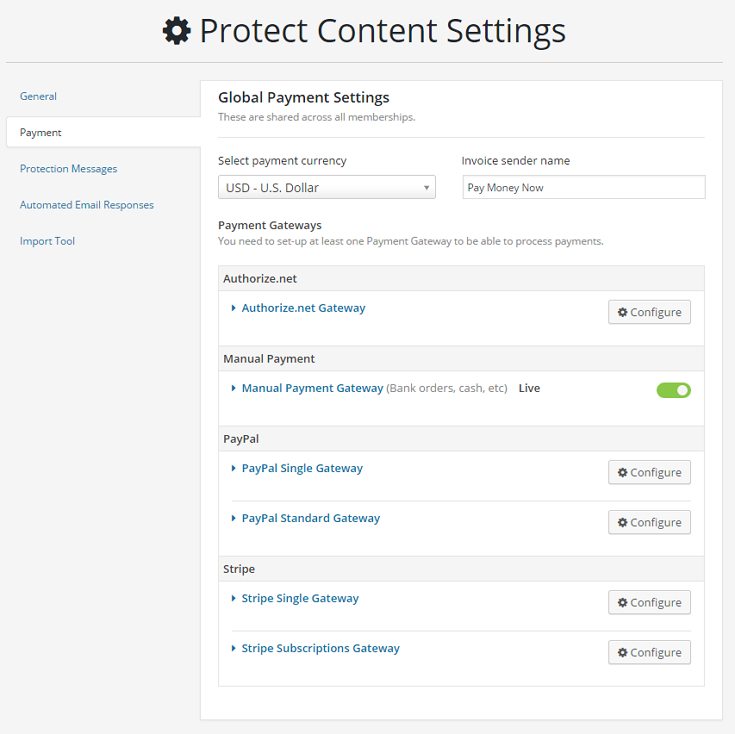

  Du kannst das Gateway oder die Gateway-Kombination wählen, die den Anforderungen Deiner Mitglieder entspricht. Du kannst die unterstützten Gateways unter **Mitgliedschaften > Einstellungen > Zahlungen** einrichten. Sobald die Zahlungsgateways eingerichtet sind, gehe zurück zu **Mitgliedschaften > Mitgliedschaften** und bearbeite jede bezahlte Mitgliedschaft, um das Gateway, die Kosten und die Dauer der Mitgliedschaft anzugeben.  

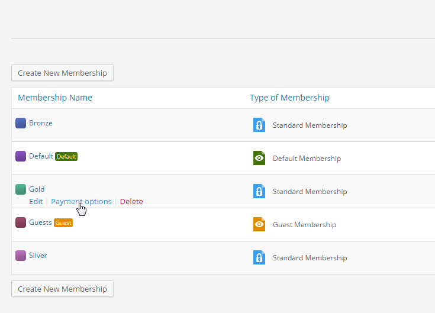

 Bewege den Mauszeiger, um den Link „Zahlungsoptionen“ anzuzeigen.

   

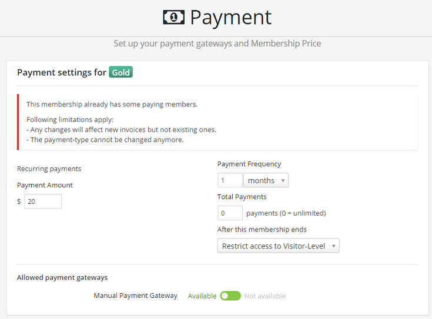

 Zahlungsoptionen für PS Mitgliedschaften-Abonnements

Wenn Du wiederkehrende Abonnementzahlungen akzeptieren möchtest, benötigst Du entweder PayPal Standard oder Stripe Subscriptions zur Zahlungsabwicklung. Nachdem Deine Mitgliedschaften, der Inhaltsschutz und die Zahlungsinformationen eingerichtet sind, musst Du nur noch ein paar persönliche Daten hinzufügen und Deine Levels überprüfen, um sicherzustellen, dass alles wie erwartet funktioniert.

##### Schritt 6: Letzte Schritte & Zusammenführung

Du wirst feststellen, dass Du in PS Mitgliedschaften noch einige weitere Einstellungen vornehmen kannst. Werfen wir einen kurzen Blick darauf. Nachrichten zu geschützten Inhalten – Du kannst den Text ändern (und sogar Bilder und ansprechende Designs hinzufügen!), wenn ein Nutzer versucht, Inhalte anzuzeigen, auf die er keinen Zugriff hat. Du findest diese Nachrichten unter **Mitgliedschaften > Einstellungen > Schutznachrichten**. PS Mitgliedschaften bietet außerdem einen praktischen „Mitgliedschaftssimulator“, mit dem Du Deine Webseite so anzeigen kannst, als wärst Du Mitglied einer (oder keiner) Deiner Mitgliedschaften. Bevor Du Feierabend machst, nimm Dir noch ein paar Minuten Zeit und überprüfe Deine Mitgliedschaften, um sicherzustellen, dass Du das siehst, was Du ihnen zeigen möchtest. Um auf den Simulator zuzugreifen, klicke in der Symbolleiste Deines Adminbereichs oder im Frontend Deiner Webseite auf die Schaltfläche **Mitgliedschaften testen**. Das Simulatorfenster wird dann oben rechts auf jeder Seite Deiner Webseite angezeigt.

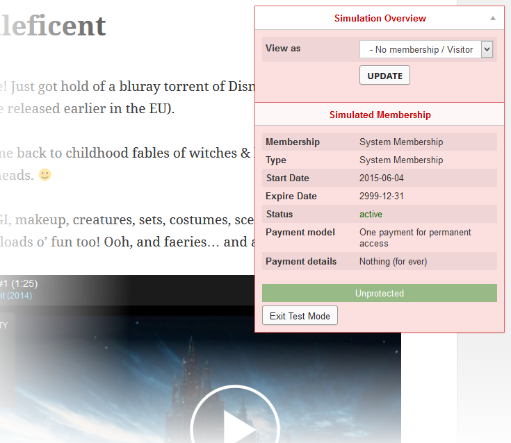

  Belohne Dich mit einem Schulterklopfen, Du schaffst das!

### PS Mitgliedschaften Add-Ons

Der wahre Zauber von PS Mitgliedschaften liegt in den Add-Ons. Alle Add-Ons sind enthalten, Du kannst aber nur die für Dein individuelles Setup passenden aktivieren. So musst Du Dich nicht mit unnötigen Elementen herumschlagen. Wenn Du beispielsweise BuddyPress nicht auf Deiner Webseite installiert hast, wird dieses Add-On ausgegraut und Du erhältst eine Meldung, dass BuddyPress vor der Nutzung aktiviert werden muss. 

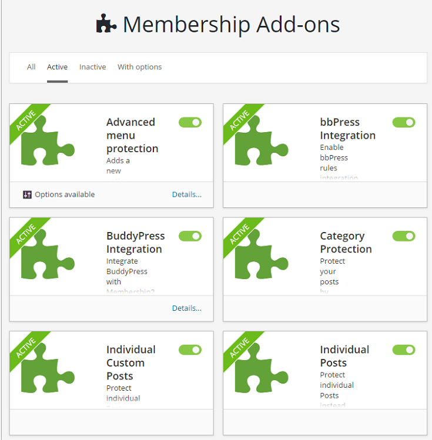

    Die folgenden Add-Ons sind enthalten: _Zusätzliche automatisierte Nachrichten_ – mit diesem Add-On kannst Du benutzerdefinierte automatische Nachrichten für Mitglieder erstellen.  

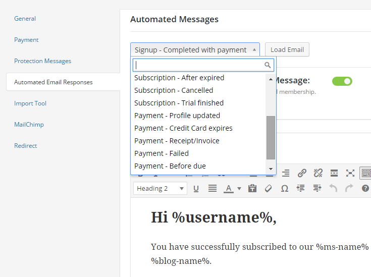

 PS Mitgliedschaften Zusätzliche automatisierte E-Mails

_Admin-Schutz_ – Möchtest Du Deinen Inhaltsschutz auf Deinen Admin-Bereich ausweiten? Dieses Add-on macht es möglich.  

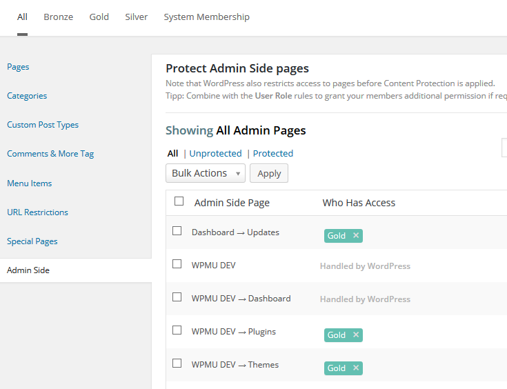

 PS Mitgliedschaften Admin-Schutz

_Erweiterter Menüschutz_ – Dieses Add-on bietet drei Optionen für die optimale Kontrolle über den Zugriff auf Deine Navigationsmenüs. Klickeim Add-on auf den Link „Details“, um die gewünschte Option auszuwählen.

* Einzelne Menüpunkte schützen (Standard)
* Einzelne Menüs ersetzen
* Inhalt von Menüpositionen überschreiben

Die gewählte Option bestimmt die zusätzlichen Einstellungen, die unter **Mitgliedschaften > Schutzregeln** verfügbar sind, sodass Du die Zugriffsregeln für Deine Menüs anpassen kannst.

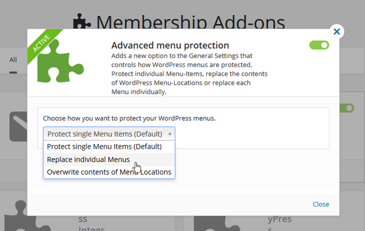

 PS Mitgliedschaften Erweiterter Menüschutz

  _bbPress-Integration_ – Wenn Du bbPress nutzt, kannst Du Deine bbPress-Foren mit diesem Add-on schützen.  

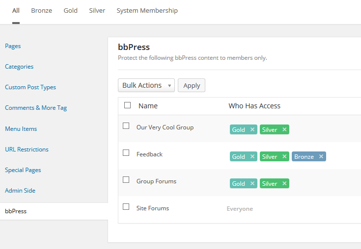

 PS Mitgliedschaften bbPress-Schutz

  _BuddyPress-Integration_ – Wenn Deine Webseite BuddyPress verwendet, kannst Du mit diesem Add-on Gruppen, Profile und mehr schützen. 

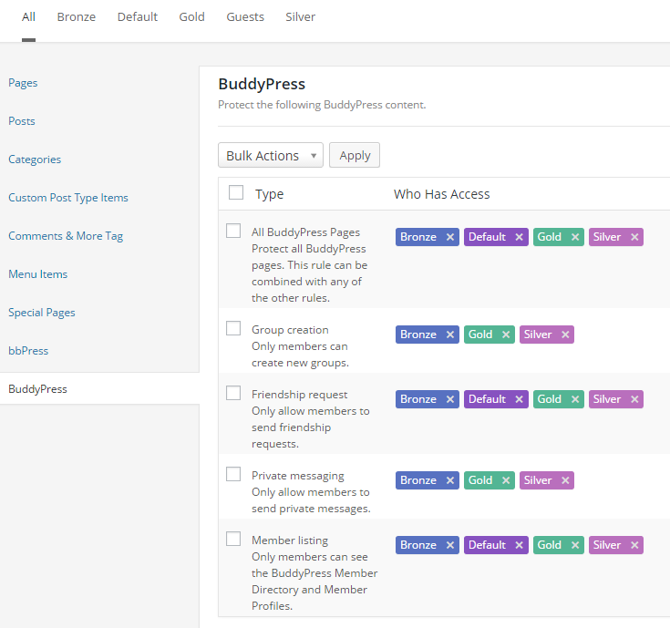

 PS Mitgliedschaften BuddyPress-Schutz

  _Kategorienschutz_ – Wenn Du Beiträge nach Kategorien schützen möchtest, ist dieses Add-on kinderleicht. 

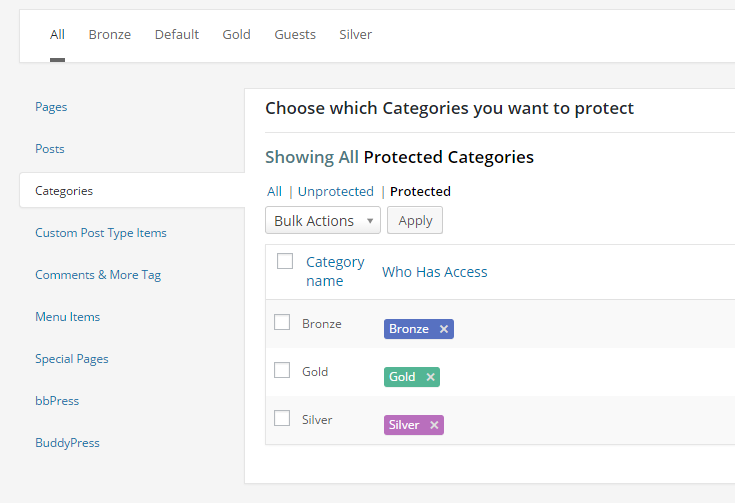

 PS Mitgliedschaften Schutz der Kategorie

  _Coupon_ – Biete Gutscheine für Mitgliedschaften an.

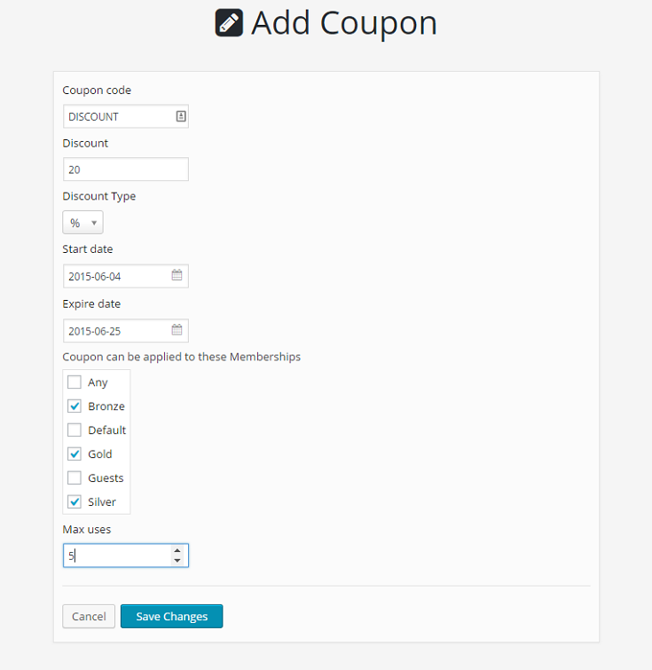

 PS Mitgliedschaften: Neue Gutscheineinstellungen hinzufügen

_Individuelle benutzerdefinierte Beiträge_ – Wenn Du den Zugriff auf benutzerdefinierte Beiträge für jeden Beitrag einzeln steuern möchtest, ist dieses Add-on hilfreich. Wenn aktiviert, wird der Reiter _Benutzerdefinierte Beitragstypen_ unter **Mitgliedschaften > Schutzregeln** durch _Elemente für benutzerdefinierte Beitragstypen_ ersetzt. Hier kannst Du die Elemente auswählen, die Du für jede Mitgliedschaft schützen möchtest.

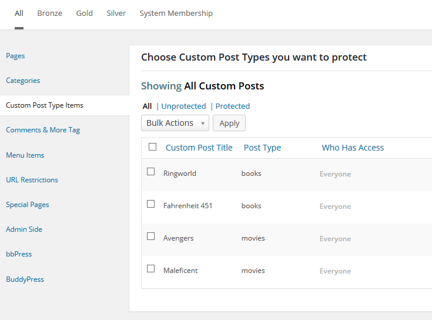

 PS Mitgliedschaften Schutz für benutzerdefinierte Beitragstypen

_Einzelne Beiträge_ – Wie das obige Add-on, jedoch für Standard-WordPress-Blogbeiträge. Bei Aktivierung fügt dieses Add-on unter **Mitgliedschaften > Schutzregeln** einen neuen Tab mit dem Namen _Beiträge_ hinzu, in dem Du einzelne Beiträge schützen kannst.

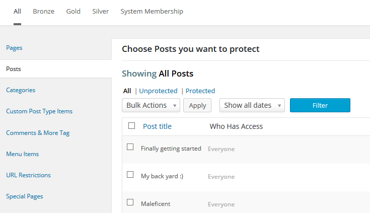

 PS Mitgliedschaften Post Schutz

MailChimp-Integration – Wenn Du MailChimp nutzt, kannst Du mit diesem Add-on Deine Nutzer automatisch in Deine MailChimp-Listen aufnehmen. Unter **„Mitgliedschaften“ > „Einstellungen“** im Reiter „MailChimp“ stehen Dir drei Optionen zur Verfügung. Dort kannst Du auswählen, welche Listen für registrierte Nutzer ohne Mitgliedschaft, Mitglieder und deaktivierte Mitglieder verwendet werden sollen.  

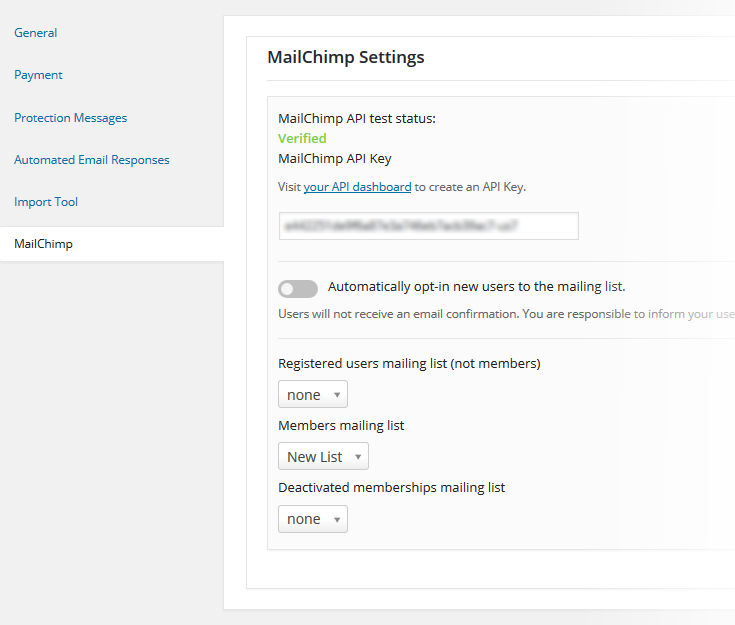

 PS Mitgliedschaften MailChimp-Integration

_Medienschutz_ – Wie der erweiterte Menüschutz bietet dieses Add-on drei Optionen zur individuellen Anpassung des Medienschutzes. 

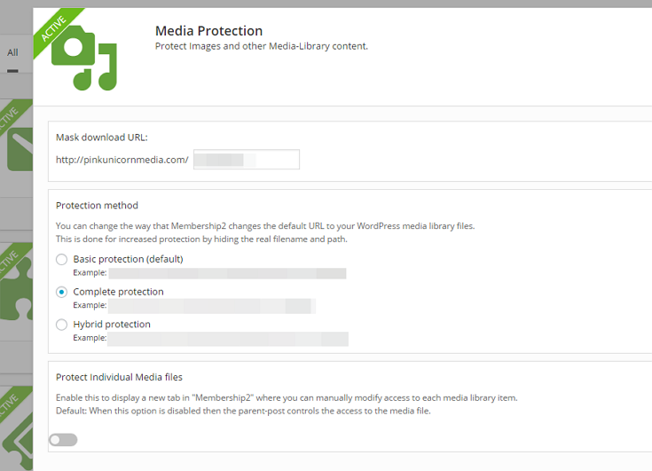

 PS Mitgliedschaften Medienschutzoptionen

_Mitgliederberechtigungen_ – Mit diesem Add-on kannst Du einzelnen Mitgliedern Berechtigungen/Zugriffe auch außerhalb ihrer Mitgliedschaftsstufe erteilen. 

 PS Mitgliedschaften Erweiterte Funktionen

_Mehrere Mitgliedschaften_ – Wenn Nutzer mehrere Mitgliedschaften gleichzeitig auf Deiner Webseite haben müssen, ermöglicht dieses Add-on dies. Es entstehen jedoch keine neuen Einstellungen. **Wichtiger Hinweis:** Mitglieder mit mehreren Mitgliedschaftsstufen erhalten im Konfliktfall standardmäßig die Berechtigungen der jeweils höchsten Stufe. Nehmen wir beispielsweise an, Du betreibst eine Webseite, die sich auf das Thema Handwerk konzentriert. Dort können Mitglieder beliebige Mitgliedschaften abschließen, wobei jede Mitgliedschaft auf einem Handwerk basiert. Wenn die Stricker Zugriff auf alle benutzerdefinierten Beitragstypen haben, die Stitcher jedoch nicht, und Bev sowohl bei den Strickern als auch bei den Stitchern Mitglied ist, hat Bev Zugriff auf alle benutzerdefinierten Beitragstypen. 

  PS Mitgliedschaften Spezial Seiten schützen

_Spezialseiten schützen_ – Der Spezialseitenschutz umfasst Archive, 404-Fehlerseiten und Suchergebnisseiten und bietet so umfassenden Schutz für Deine Website.

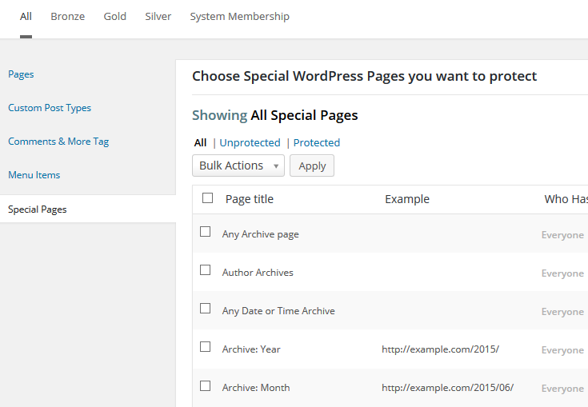

 PS Mitgliedschaften Spezialseiten-Schutz

_Weiterleitungssteuerung_ – Wenn Du steuern möchtest, wohin Benutzer nach dem An- und Abmelden weitergeleitet werden, ist dieses Add-on eine große Hilfe. Ein zukünftiges Update ermöglicht möglicherweise die Einrichtung benutzerdefinierter Weiterleitungen basierend auf Mitgliedschaften. 

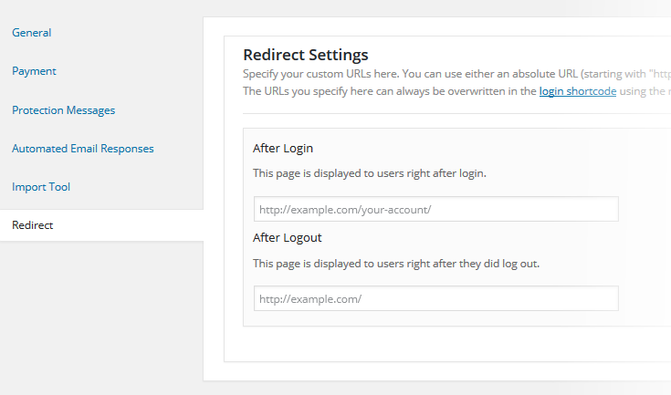

 PS Mitgliedschaften Weiterleitungseinstellungen

_Shortcode-Schutz_ – Mit diesem Add-on kannst Du Inhalte schützen, die über Shortcodes von WordPress oder anderen Plugins ausgegeben werden. Super! 

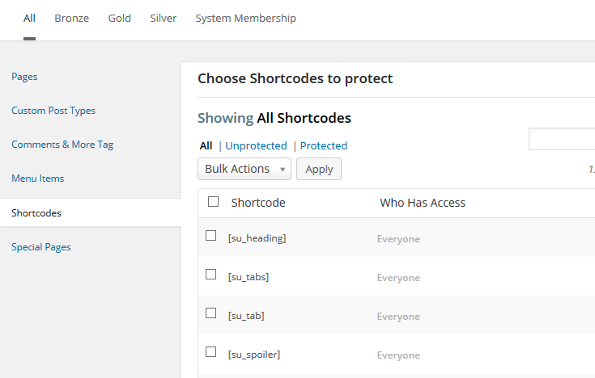

 PS Mitgliedschaften Shortcode-Schutz

_Taxamo_ – Gelten die EU-Mehrwertsteuervorschriften für Dich? Wir unterstützen Dich. Dieses Add-on fügt einen neuen Tab unter „Mitgliedschaften > Einstellungen“ hinzu, in dem Du Deine Taxamo-Einstellungen einrichten kannst. 

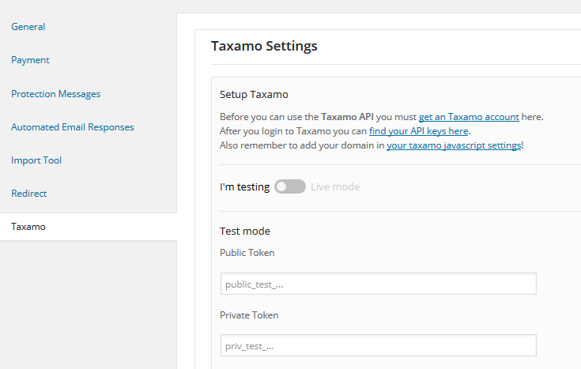

 PS Mitgliedschaften Taxamo-Einstellungen

_Testphase_ – Wenn Du potenziellen zahlenden Mitgliedern einen kostenlosen Vorgeschmack auf die Vorteile einer Mitgliedschaft auf Deiner Webseite geben möchtest, aktiviere die Testphase. Für jede kostenpflichtige Mitgliedschaft steht Dir in den Zahlungseinstellungen eine neue Option zur Verfügung. 

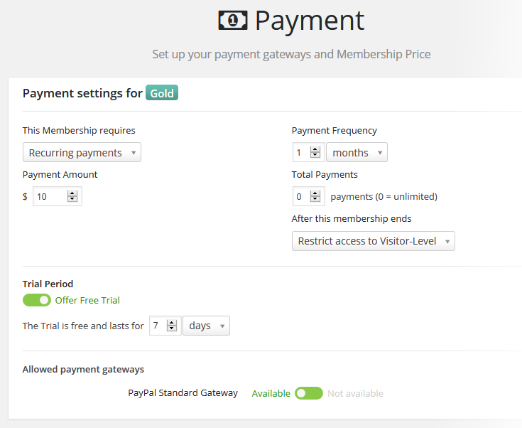

 PS Mitgliedschaften Testzeitraum

_URL-Schutz_ – Wenn keines der anderen Add-ons ausreicht, kannst Du mit dem URL-Schutz Inhalte über die Seiten-URL schützen. Der URL-Schutz unterstützt reguläre Ausdrücke, sodass Du bestimmte Inhalte beliebig detailliert analysieren kannst. Beachte jedoch, dass hier hinzugefügte Regeln alle anderen Regeln außer Kraft setzen.

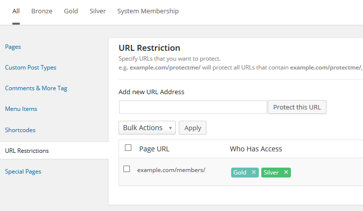

 PS Mitgliedschaften-URL-Einschränkungen

### Bekannte Probleme

Cache-Plugins können die Funktionalität des Plugins beeinträchtigen. Wenn Deinen Nutzern nach erfolgreicher Zahlung und Anmeldung auf Deiner Webseite keine Mitgliedschaften zugewiesen werden, prüfe ob der Objekt-Cache in Deinem Cache-Plugin aktiviert ist. Füge in diesem Fall Folgendes zu den nicht persistenten Feldern/Gruppen hinzu: `MS_Model_Membership MS_Model_Member MS_Model_Communication_Invoice`

