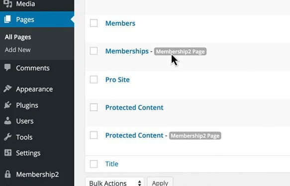

<link rel="stylesheet" href="assets/style.css">

<h2 align="center" style="color:#38c2bb;">📚 Inhaltsverzeichnis</h2>

  <a href="#features" style="color:#38c2bb;">🚀 Features</a> •
  <a href="#schnelleinstieg" style="color:#38c2bb;">📖 Schnelleinstieg</a> •
  <a href="https://github.com/cp-psource/mitgliedschaften-pro/discussions" style="color:#38c2bb;">💬 Forum</a> •
  <a href="https://github.com/cp-psource/mitgliedschaften-pro/releases" style="color:#38c2bb;">📝 Download</a>

## Starte mit PS Mitgliedschaften eine Mitgliedschaftsseite, um ganz einfach jedes Mitgliedschaftssystem einzurichten, das Du Dir vorstellst.

Erweitere Deine Fangemeinde mit kostenlosen, geschützten Inhalten, baue ein Geschäft mit kostenpflichtigem Zugang auf oder betreibe ein Online-Magazin mit verteilten Artikeln und Videos.

### Vier flexible Mitgliedschaftsarten

Nutze die enthaltenen Mitgliedschaftsarten, um Deine Inhalte schnell für Mitglieder verfügbar zu machen und für abgemeldete Nutzer auszublenden, Inhalte in bestimmten Zeitabständen freizugeben, den Zugriff auf nur wenige Elemente zu beschränken oder Inhalte nur für angemeldete Nutzer verfügbar zu machen, die noch nicht beigetreten sind .

### Mache es nur für Mitglieder

Beschränke den Zugriff auf Seiten, Beiträge, Kategorien, Videos, Audio, Bilder, PDFs, digitale Downloads, Foren und sogar bestimmte Wörter und Links – Du bestimmst, wer was auf Deiner Webseite sieht.

## Mehr Optionen und weniger Kopfschmerzen

Verwende integrierte Add-ons, um PS Mitgliedschaften zu erweitern, wenn Deine Webseite wächst. Aktiviere nur die Funktionen, die Du benötigst, um die Geschwindigkeit zu steigern und Zeit zu sparen.

**Automatisierte Nachrichten**

Erweiterte automatisierte E-Mail-Antworten für Veranstaltungen.

**Admin-seitiger Schutz**

Kontrolliere den Zugriff auf Elemente im WordPress-Dashboard.

**Menüschutz**

Menüs für Besucher und Mitglieder hinzufügen, schützen und ersetzen.

**bbPress-Integration**

Nutze Mitgliedschaften, um die bbPress-Funktionen zu erweitern.

**BuddyPress-Integration**

Erstelle mit BuddyPress ein exklusives soziales Netzwerk.

**Kategorieschutz**

Verwende Kategorien, um eine Gruppe von Beiträgen zu schützen.

**Mitgliedsgutscheine**

Erstelle Gutscheine und Rabatte, um Dein Geschäft auszubauen.

**Beitragsschutz**

Schütze sowohl Beiträge als auch benutzerdefinierte Beitragstypen.

**Einladungscodes**

Nutzer benötigen einen Einladungscode, um sich anzumelden.

**Medienschutz**

Schütze Bilder und andere Inhalte Deiner Medienbibliothek.

**Mitgliederfunktionen**

Verwalte die Benutzerfunktionen basierend auf der Mitgliedschaftsstufe.

**Benutzerdefinierte Attribute**

Füge benutzerdefinierte Attribute hinzu, die Du in Shortcodes und Code verwenden kannst.

**Mehrfachmitgliedschaften**

Du kannst mehrere Mitgliedschaften gleichzeitig abschließen.

**Anteiliger Betrag**

Anteiliger Betrag bei Mitgliedschaftswechsel.

**Profilfelder**

Passe die Felder für Dein Profil und das Registrierungsformular an.

**Spezialseiten schützen**

Schütze Spezialseiten wie Suchergebnisse.

**Weiterleitungssteuerung**

URL nach An- und Abmeldung festlegen.

**Suchindex**

Suchmaschinen erlauben, geschützte Inhalte zu indexieren.

**Shortcodes**

Schütze Inhalte mit Shortcodes.

**Taxamo**

Aktiviere diese Option, um die EU-Mehrwertsteuervorschriften einzuhalten.

**Testzeitraum**

Lege kostenlose Testangebote für die Mitgliedschaft fest.

**URL-Schutz**

Schütze jede beliebige Seite Deiner Webseite.

**WPML-Integration**

Nutze WPML, um Plugin-Nachrichten zu übersetzen.

**WP reCaptcha**

Aktiviere die WP reCaptcha-Integration.
   

### Vier zuverlässige Zahlungsoptionen

Schütze Deinw Inhalte mit einem Mitglieder-Login und profitiere von einer automatisierten Abwicklung. Wähle aus vier Zahlungsoptionen in 25 Währungen. Bezahle mit PayPal, Stripe, Authorize.net oder ganz einfach per manueller Zahlung.

PS Mitgliedschaften enthält alles, was Du brauchst, um sofort mit der Zahlungsabwicklung zu beginnen – keine teuren Erweiterungen.
 

### Mehr Nutzer verwalten

Finde und füge Mitglieder schnell über das Dashboard hinzu. Sehe Dir die Art der Mitgliedschaft, deren Ablaufdatum und ausstehende Zahlungen an. Oder besuche die Übersicht, um aktuelle Nachrichten, Statistiken, Neuanmeldungen und eine Liste der für angemeldete Mitglieder verfügbaren Inhalte anzuzeigen.

 Mit PS Mitgliedschaften kannst Du Deine Benutzer ganz einfach verwalten.
 

 Wir haben eine Erfahrung geschaffen, die das Einrichten einer Mitgliederseite einfach und intuitiv macht, sodass Du noch schneller mit dem Schutz Deiner Inhalte beginnen kannst.

### Intelligenter Einrichtungsassistent

Mit PS Mitgliedschaften gibt es kein Rätselraten mehr. Unser Einrichtungsassistent führt Sie durch die Konfiguration Deiner Mitgliederseite. Er bietet sogar einen Simulationsmodus, mit dem Du schnell überprüfen kannst, ob alles funktioniert, bevor Du Deine Seite live schaltest.
 

 Konfiguriere PS Mitgliedschaften von einem Ort aus für Dein gesamtes Netzwerk.

### Echter Multisite-Schutz

PS Mitgliedschaften bietet spezielle Funktionen für Multisite-Netzwerkadministratoren. Konfiguriere den Inhaltsschutz zentral – selbst in großen Netzwerken. Das sind WordPress-Superkräfte für Dein Netzwerk.

### Automatisches Erstellen neuer Seiten

PS Mitgliedschaften erstellt automatisch die benötigten Seiten und lässt Dich auswählen, welche Seiten einbezogen werden sollen. Die vom Plugin erstellten Seiten sind markiert, sodass Du sie in Deiner Seitenliste schnell finden und verwalten kannst.

 Seitenbeschriftungen erleichtern die Verwaltung von Seiten, die automatisch von PS Mitgliedschaften erstellt wurden.

### Schutzmeldungen

Ermutige Besucher Deiner Webseite, sich für exklusiven Zugriff auf Mitgliederinhalte anzumelden. Zeige abgemeldeten Benutzern eine sorgfältig gestaltete Nachricht mit Details und Informationen zum Beitritt zu Deiner Webseite an.

 Erstelle benutzerdefinierte Paywall-Nachrichten.

 

 Integriertes Admin-E-Mail-System.

### Automatisierte E-Mail-Nachrichten

Sende neuen Mitgliedern automatisch eine E-Mail, sobald sie sich auf Deiner Webseite anmelden. Bedanke Dich für die kostenlose Mitgliedschaft und biete ihnen einen Gutschein für eine ermäßigte Mitgliedschaft an.

 

 Aktiviere oder deaktiviere den Inhaltsschutz auf Deiner gesamten Seite, um eine einfache und leistungsstarke Kontrolle zu erhalten.

### Kontrolliere den Inhaltsschutz Deiner gesamten Webseite

Schalte den Inhaltsschutz ganz einfach ein oder aus – entweder über die übersichtliche Benachrichtigung in der Admin-Leiste oder direkt in den Einstellungen von PS Mitgliedschaften.

### Pro-Ergebnisse – Einfache Shortcode-Integrationen

Nutze Shortcodes für alles, von der einfachen Anzeige der Mitgliedschaftsart bis zum Schutz bestimmter Inhalte vor Nutzern bestimmter Mitgliedschaftsstufen.

### Nutze die Vorteile der PS Mitgliedschaften-Integrationen

PS Mitgliedschaften bietet integrierten erweiterten Schutz für Mitgliedschaftsfunktionen für Affiliates, Custom Sidebars Pro, Events+, PopUp Pro und Appointments+. Darüber hinaus erleichtert die PS Mitgliedschaften API die Integration Deiner bevorzugten Plugins und erweitert Deine Mitgliederseite.

Willkommen bei PS Mitgliedschaften! Die neue, verbesserte Version unserer Plugins für Mitgliedschaft und geschützte Inhalte ist die bisher beste Version.

## Erste Schritte

### Erstellen einer Mitgliederseite mit M2

Wenn Du bereits Mitgliedschaften oder geschützte Inhalte nutzt, ist Dir PS Mitgliedschaften bestens vertraut. Mit PS Mitgliedschaften kannst Du bis ins kleinste Detail steuern, welche Inhalte welchen Mitgliedern angezeigt werden. Ob kostenlose oder kostenpflichtige Mitgliedschaft – Du kannst Inhalte hinter einer Paywall schützen oder einen privaten Bereich für Deine kostenlosen Mitglieder einrichten. Beginnen wir jetzt mit der Erstellung Deiner Webseite.

##### Schritt 1: Plan erstellen

Der erste Schritt besteht darin, einen Plan zum Schutz von Inhalten zu erstellen. Erstelle ein Diagramm oder eine Skizze, wie Deine Webseite funktionieren soll. Welche Mitgliedschaftsstufen wünschst Du? Welche Inhalte sollen die Nutzer der einzelnen Mitgliedschaften sehen und welche nicht? Sollen Dein Inhalte bei einigen Mitgliedschaften dauerhaft geschützt sein, bei anderen jedoch erst nach und nach oder zu bestimmten Terminen zugänglich sein? Wenn Du für den Zugriff Gebühren erhebst, wie viel kostet dieser und wie akzeptierst Du Zahlungen? PS Mitgliedschaften kann all das und noch mehr!

 Beginne mit einem Plan zum Schutz Deiner Inhalte.

Wenn Du PS Mitgliedschaften in einem Netzwerk mit mehreren Standorten installiert oder darauf aktualisiert hast, solltest Du Dich bei Deiner Planung unter anderem entscheiden, ob Deine Inhaltsschutzregeln für jede Seite einzeln gelten sollen oder ob Du die netzwerkweiten Schutzfunktionen von PS Mitgliedschaften nutzen möchtest. Wenn Inhalte für jede Seite einzeln geschützt werden sollen, aktiviere einfach das Plugin auf der Seite, auf der Deine Inhalte geschützt werden sollen, und fahre mit der Einrichtung fort, wie im Rest dieser Anleitung beschrieben. Wenn Du jedoch netzwerkweite Inhaltsschutzregeln erstellen möchtest, musst Du zuerst die folgende Konstante zu Deiner Datei wp-config.php hinzufügen: „define( ‚MS_PROTECT_NETWORK‘, true );“ Anschließend kannst Du von Deinem Netzwerkadministrator aus Schutzregeln für jede Seite in Deinem Netzwerk einrichten. Juhu! **Wichtiger Hinweis:** Die obige Konstante funktioniert nur, wenn sie zu wp-config.php hinzugefügt wird, _bevor_ Du mit der Erstellung Deiner Mitgliedschaften beginnst. Bestehende Mitgliedschaften auf einer Seite in Deinem Netzwerk werden von den Netzwerkeinstellungen _nicht_ erkannt. Eine zukünftige Version von PS Mitgliedschaften ermöglicht es vielleicht, dass bestehende Mitgliedschaften auch netzwerkweit funktionieren. Sobald Du eine grobe Skizze Deines Plans hast, kannst Du mit dem Aufbau Deines Inhaltsschutzes beginnen.

##### Schritt 2: Mitgliedschaften erstellen

Wenn Du nach der Installation des Plugins nicht sofort zur Einrichtungsseite weitergeleitet wirst, klicke im Menü „Mitgliedschaften“ auf den Menüpunkt „Einrichtung“.  

  Mitgliedschaften sind das Herzstück von PS Mitgliedschaften. Mit den von Dir erstellten Mitgliedschaften kannst Du jeden weiteren Schritt im Einrichtungsprozess abschließen. Zu Beginn erhältst Du standardmäßig eine „Systemmitgliedschaft“. Alle aktuellen Mitglieder behalten diese Mitgliedschaft, bis sie sich entscheiden oder in einen anderen Plan wechseln. Mit PS Mitgliedschaften kannst Du vier verschiedene Mitgliedschaftsarten erstellen.  

  _1\. Standardmitgliedschaft:_ Die meisten Standardmitgliedschaften sind Standardmitgliedschaften. Standardmitgliedschaften können kostenlos oder kostenpflichtig sein. Du kannst beliebig viele Standardmitgliedschaften erstellen. Wenn Du ein abgestuftes System wie Bronze, Silber und Gold anbieten möchtest, erstelle für jede Stufe eine Standardmitgliedschaft. _2\. Gastmitgliedschaft:_ Eine Gastmitgliedschaft legt Regeln für nicht angemeldete Besucher Deiner Webseite fest. Wenn Du Deinen Besuchern individuelle Zugriffsregeln gewähren möchtest, benötigst Du eine Gastmitgliedschaft. Du kannst nur eine Gastmitgliedschaft erstellen, die für alle Gäste gilt. _3\. Dripped-Mitgliedschaft:_ Diese Mitgliedschaft wird verwendet, wenn Du Inhalte hast, auf die jeweils nur ein Teil/eine Gruppe Zugriff haben soll. In den Einstellungen dieser Mitgliedschaft kannst Du Daten oder Zeitspannen festlegen, in denen Inhalte angezeigt oder ausgeblendet werden sollen. _4\. Standardmitgliedschaft:_ Diese Mitgliedschaft ähnelt der standardmäßig hinzugefügten Systemmitgliedschaft. Sie ist für alle registrierten/angemeldeten Benutzer gedacht, die derzeit keinem anderen Mitgliedschaftsplan angehören. Wie bei der Gastmitgliedschaft kann es auf Deiner Webseite nur eine Standardmitgliedschaft geben. Das Anlegen einer neuen Mitgliedschaft ist ganz einfach. 1. Gehe zu **Mitgliedschaften > Mitgliedschaften**. 2. Klicke auf „Neue Mitgliedschaft erstellen“. 3. Wähle die gewünschte Mitgliedschaftsart aus der Liste mit vier Optionen. 4. Benenne Deine Mitgliedschaft. 5. Speicher Deine Mitgliedschaft. Erstelle alle benötigten Mitgliedschaften (Du kannst sie auch später hinzufügen, bearbeiten oder entfernen), und wir fahren mit dem nächsten Schritt fort. Kümmer Dich jetzt noch nicht um die Einrichtung von Abrechnungs- oder Zahlungsgateways, diese fügen wir später hinzu.

##### Schritt 3: PS-Mitgliedschaftsseiten

Als Nächstes geht es schnell und einfach: Richte die für PS Mitgliedschaften benötigten Seiten ein. Gehe dazu zu **Mitgliedschaften > Einstellungen > Allgemeines**

 

1. Stelle sicher, dass Du für PS Mitgliedschaften die Seiten „Mitgliedschaften“, „Registrieren“, „Konto“, „Geschützte Inhalte“ und „Registrierung abgeschlossen“ eingerichtet hast.
2. Lege fest, welche Elemente in Deinem Hauptnavigationsmenü angezeigt werden sollen.
3. Lege fest, ob die schwarze Admin-Leiste, die normalerweise oben auf jeder Seite Deiner Webseite angezeigt wird (mit der Aufschrift „Howdy, you“), auch für Mitglieder angezeigt werden soll. Warte jedoch am besten, bis Du alle Einstellungen vorgenommen hast, bevor Du den Inhaltsschutz aktivierst.

**Wichtige Hinweise:**

* Wenn Du ein Plugin wie BuddyPress, Pie Register oder Gravity Forms verwenden, um eine benutzerdefinierte Registrierungsseite zu erstellen, wähle hier unbedingt DIESE Registrierungsseite aus und nicht die Standardseite des PS Mitgliedschaften-Plugins.
* Wenn Du ein anderes Plugin für die Registrierung verwendest, füge den folgenden Code in die Datei _functions.php_ Deines Themes ein, damit das PS Mitgliedschaften-Plugin davon Kenntnis hat (dies ist für BuddyPress nicht erforderlich, stört aber nicht, wenn Du ihn trotzdem hinzufügst): `add_filter('ms_frontend_handle_registration', '__return_false');`

##### Schritt 4: Inhaltsschutz

**Mitgliedschaften > Schutzregeln** ist Deine zentrale Anlaufstelle, um festzulegen, wer welche Inhalte sehen darf – alles auf einer übersichtlichen und benutzerfreundlichen Seite. Die Inhaltsschutzoptionen werden in einer vertikalen Liste mit Registerkarten angezeigt. Klicke auf eine dieser Registerkarten, um den Inhaltsschutz für den jeweiligen Inhaltstyp festzulegen.

 PS Mitgliedschaften-Seitenschutzeinstellungen

   

 PS Mitgliedschaften Kommentar- und Mehr-Tag-Schutz

Wenn keine Add-ons aktiviert sind, kannst Du mit PS Mitgliedschaften Seiten, benutzerdefinierte Beitragstypen, Kommentare und den „Mehr“-Tag schützen (weitere Informationen zu den verfügbaren Add-ons findest DU weiter unten). Außerdem bietet PS Mitgliedschaften Einstellungen für den grundlegenden Schutz von Menüelementen. 

 M2 Menu Protection

  You'll see the default mode is for everyone to be able to see everything. If you hover over any content item's current access, you'll see a "modify access link." Click this to restrict this content item to only members of the membership(s) you assign. A colorful pop up will appear with each of your memberships listed. Click the memberships you want, and move through the content items, and tabs, one by one until you're satisfied with your settings.

##### Step Five: Billing, Subscriptions, and Payment, Oh My!

M2 comes packed with several payment gateway options. Authorize.net Manual payments PayPal Single PayPal Standard Stripe Single Stripe Subscriptions  

  You can choose whichever gateway or combination of gateways meets the needs of your an your members. You can set up your supported gateways via **Membership2 > Settings > Payments**. When payment gateways are set up, go back to **Membership2 > Memberships**, and edit each paid membership to include the gateway, the cost, and the duration of the membership.  

 Hover to see the Payment Options link.

   

 M2 Subscription Payment Options

  If you're planning on accepting recurring subscription payments, you'll need to use either PayPal Standard or Stripe Subscriptions to manage the payments. Now that your memberships, content protection, and payment information are all in place, all that's left is adding a few more personal details and checking your levels to ensure everything is working as expected.

##### Step Six: Final Steps & Pulling it All Together

You'll notice there are still a few more settings in M2 you can adjust. Let's take a quick look. Protected Content Messages - You can change the text (and even add images and fancy styling!) when a user is trying to view content they don't have access to. You'll find these messages in **Membership2 > Settings > Protection Messages**. M2 also comes with a very handy "Membership Simulator" tool that allows you to view your site as if you were a member of any (or none) of your Memberships. Before you call it a day, take a few minutes and run through each of your Memberships to make sure they see what you want them to see. To access the Simulator, click the **Test Memberships** button in the toolbar in your admin or on the frontend of your site. You'll then see the Simulator window in the top-right corner on every page of your site.  

  Reward yourself with a pat on the back, you're getting there!

### Membership2 Add-Ons

The real magic in Membership2 is in the Add Ons. All the Add-Ons are included, but only those that apply to your individual set-up can be enabled so you don't need to deal with any items you don't need. For example, if you do not have BuddyPress installed on your site, that Add-On will be greyed out with a message informing you that BuddyPress needs to activated before you can use it.  

    The following Add-Ons are included: _Additional Automated Messages_ - this add on allows you create custom auto-messages for members.  

 M2 Additional Automated Emails

  _Admin Side Protection_ - Want to extend your content protection to your Admin area? This add on will do just that.  

 M2 Admin Side Protection

  _Advanced Menu Protection_ - This Add-On has three options to allow the ultimate control over access to your navigation menus. Click the Details link in the Add-On to select the option you want.

*   Protect Single Menu Items (default)
*   Replace Individual Menus
*   Overwrite Contents of Menu Locations

The option you select will determine the additional settings that will become available at **Membership 2 > Protection Rules** so you can tweak the access rules for your menus.  

 M2 Advanced Menu Protection

  _bbPress Integration_ - If you're a bbPress user, you can protect your bbPress forums with this add on.  

 M2 bbPress Protection

  _BuddyPress integration_ - If your site uses BuddyPress, this add on will let you protect groups, profiles, and more.  

 M2 BuddyPress Protection

  _Category Protection_ - If you'd like to protect posts by category, this add on makes it super simple.  

 M2 Category Protection

  _Coupon_ - Offer coupons for memberships.  

 M2 Add New Coupon Settings

    _Individual Custom Posts_ - If you'd like to control access to custom posts on a post-by-post basis, this add on will help. When enabled, the _Custom Post Types_ tab under **Membership 2 > Protection Rules** will be replaced with _Custom post Type Items_ where you can select the specific items you want to protect for each membership.  

 M2 Custom Post Type Items Protection

  _Individual Posts_ - Like the add on above, but for standard WordPress blog posts. When enaled, this Add-On will add a new tab under **Membership 2 > Protection Rules** called _Posts_ where you can protect individual posts.  

 M2 Post Protection

  _Mail Chimp Integration_ - If you're a MailChimp user, this add on allows you to automatically optin your users to your MailChimp lists. There are 3 options available under the MailChimp tab in Membership2 > Settings where you can select which lists to use for _Registered Users_ with no membership, _Members_ and _Deactivated Members_.  

 M2 MailChimp Integration

  _Media Protection_ - Like Advanced Menu Protection, this add on has three options to customize how your media is protected.  

 M2 Media Protection Options

  _Member Capabilities_ - This add on will allow you to grant permissions/access for individual members, outside of their membership level.  

 M2 Advanced Capabilities

  _Multiple Memberships_ - If you need users to have more than one simultaneous membership on your site, this add on will allow that functionality. This Add-On doesn't create any new settings for you to worry about though. **Important note:** Members who are in multiple membership levels will default to the permissions of the most permissive level they belong to, if there's a conflict. For example, let's say you have a craft-based site where members can join any memberships they want, and each membership is based on a craft. If the Knitters have access to all custom post types, but Stitchers do not, and Bev is a member of both Knitters and Stitchers, Bev will have access to all custom post types. _Protect Special Pages_ - Special page protection covers archives, 404 Pages, and search result pages, to provide truly wall-to-wall protection for your site.  

 M2 Special Pages Protection

  _Redirect Control_ - If you want to control where users are redirected after logging in or logging out, this add on will be a big help. A future update will include the ability to set custom redirects based on memberships.  

 M2 Redirect Settings

  _Shortcode Protection_ - This Add-On will enable you to protect the content that is output by shortcodes from WordPress, or even other plugins. Booya!  

 M2 Shortcode Protection

  _Taxamo_ - EU VAT regulations apply to you? We've got your back. This Add-On will add a new tab to Membership2 > Settings where you can set up your Taxamo stuff.  

 M2 Taxamo Settings

  _Trial Period_ - If you'd like to give potential paying members a free taste of how great a membership on your site can be, activate the Trial Period add on. A new option will become available in the Payment settings for each paid membership you have.  

 M2 Trial Period

  _URL Protection_ - When none of the other add ons will do, URL protection will allow you to protect content by the page URL. URL protection includes regular expression support, so you can drill down into specific content as much as you need. Be careful with this one though; any rules you add here will override all other rules.  

 M2 URL Restrictions

### Known Issues

Cache plugins can often interfere with plugin functionality. If your users are not being assigned memberships after successfully paying and logging into your site, check if you have object cache enabled in your cache plugin. If so, add the following to the non-persistent fields/groups `MS_Model_Membership MS_Model_Member MS_Model_Communication_Invoice`

<footer class="psource-footer">
  

    ❤️ Entwickelt mit Liebe von <a href="https://github.com/cp-psource" target="_blank">PSOURCE</a> 
    © 2025 – Alle Rechte vorbehalten
  

</footer>